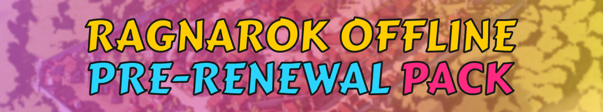

# Ragnarok Offline Pre-Renewal Pack with OpenKore (Auto-bot) Support
Hi, I'm [wrywndp](https://www.youtube.com/@wrywndp).\
This is a GitHub page for hosting a manual guide to ready-to-play Ragnarok Offline Pre-Renewal from my YouTube Channel.\
This includes instructions on how to install, download links, troubleshooting, latest update information, and custom changes.\
This project is solely for testing and educational purposes.\
Everything is free, and I'm not asking for any kind of donation or doing any monetization.\
So, please be aware of anyone who would like to get your money from this project.

## How to install?
Go to https://ragnarokoffline.github.io/

## System Specification
This is the minimum and recommended spec required to run Laragon 6.0.0 (PHP, Apache, MariaDB, and NginX), rAthena (Emulator), and Ragnarok Offline Client at the same time.

| Type | Minimum | Recommended |
| ------ | ------ | ------ |
| CPU | 2 Cores | 4 Cores |
| RAM | 8GB | 8GB |
| GPU | DirectX 7 | DirectX 7 |
| VRAM | 512MB | 1GB |
| Disk Space | 7GB | 7GB |
| OS | Windows 10 x64 | Windows 11 x64 [1] |

[1] I created and am still maintaining this pack using Windows 11 25H2. So, I CAN NOT guarantee this pack will run without a problem on an older system (Especially older than Windows 10).
